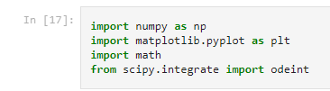
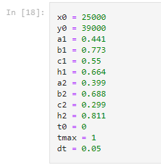
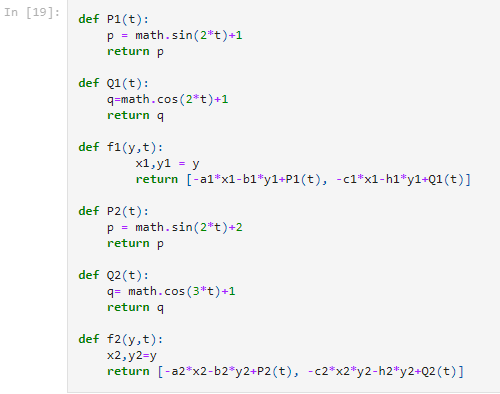
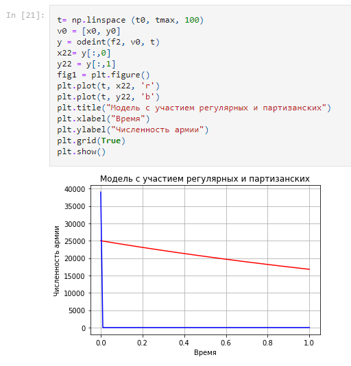

---
# Front matter
lang: ru-RU
title: "Отчет по лабораторной работе №3"
subtitle: "Группа - НФИбд-02-18"
author: "Илья Владиславович Ким"

# Formatting
toc-title: "Содержание"
toc: true # Table of contents
toc_depth: 2
lof: true # List of figures
lot: true # List of tables
fontsize: 12pt
linestretch: 1.5
papersize: a4paper
documentclass: scrreprt
polyglossia-lang: russian
polyglossia-otherlangs: english
mainfont: PT Serif
romanfont: PT Serif
sansfont: PT Sans
monofont: PT Mono
mainfontoptions: Ligatures=TeX
romanfontoptions: Ligatures=TeX
sansfontoptions: Ligatures=TeX,Scale=MatchLowercase
monofontoptions: Scale=MatchLowercase
indent: true
pdf-engine: lualatex
header-includes:
  - \linepenalty=10 # the penalty added to the badness of each line within a paragraph (no associated penalty node) Increasing the value makes tex try to have fewer lines in the paragraph.
  - \interlinepenalty=0 # value of the penalty (node) added after each line of a paragraph.
  - \hyphenpenalty=50 # the penalty for line breaking at an automatically inserted hyphen
  - \exhyphenpenalty=50 # the penalty for line breaking at an explicit hyphen
  - \binoppenalty=700 # the penalty for breaking a line at a binary operator
  - \relpenalty=500 # the penalty for breaking a line at a relation
  - \clubpenalty=150 # extra penalty for breaking after first line of a paragraph
  - \widowpenalty=150 # extra penalty for breaking before last line of a paragraph
  - \displaywidowpenalty=50 # extra penalty for breaking before last line before a display math
  - \brokenpenalty=100 # extra penalty for page breaking after a hyphenated line
  - \predisplaypenalty=10000 # penalty for breaking before a display
  - \postdisplaypenalty=0 # penalty for breaking after a display
  - \floatingpenalty = 20000 # penalty for splitting an insertion (can only be split footnote in standard LaTeX)
  - \raggedbottom # or \flushbottom
  - \usepackage{float} # keep figures where there are in the text
  - \floatplacement{figure}{H} # keep figures where there are in the text
---

# Задание

Вариант 51

Между страной Х и страной У идет война. Численность состава войск
исчисляется от начала войны, и являются временными функциями x(t) и y(t). 
В начальный момент времени страна Х имеет армию численностью 25 000 человек, а
в распоряжении страны У армия численностью в 39 000 человек. Для упрощения
модели считаем, что коэффициенты a,b,c,h постоянны. Также считаем P(t) и Q(t)
непрерывные функции.

Постройте графики изменения численности войск армии Х и армии У для
следующих случаев:

1. Модель боевых действий между регулярными войсками

2. Модель ведение боевых действий с участием регулярных войск и
партизанских отрядов

# Выполнение лабораторной работы

1. Создал отдельную папку для выполнения лабораторной работы №3. 

2. Зашел в jupyter notebook через cmd 

3. Подключил нужные библиотеки (рис. -@fig:001)

{ #fig:001 width=70% }

4. Ввел исходные данные (рис. -@fig:002)

{ #fig:002 width=70% }

5. Прописал функции возможности подхода подкрепления и систему дифференциальных уравнений (рис. -@fig:003)

{ #fig:003 width=70% }

6. Команды для вектора начальных условий, решения системы и рисования графика.(первый случай) (рис. -@fig:004)

{ #fig:004 width=70% }

7. Команды для вектора начальных условий, решения системы и рисования графика.(второй случай) (рис. -@fig:004)

{ #fig:005 width=70% }

# Выводы

Построили модель боевых действий.
